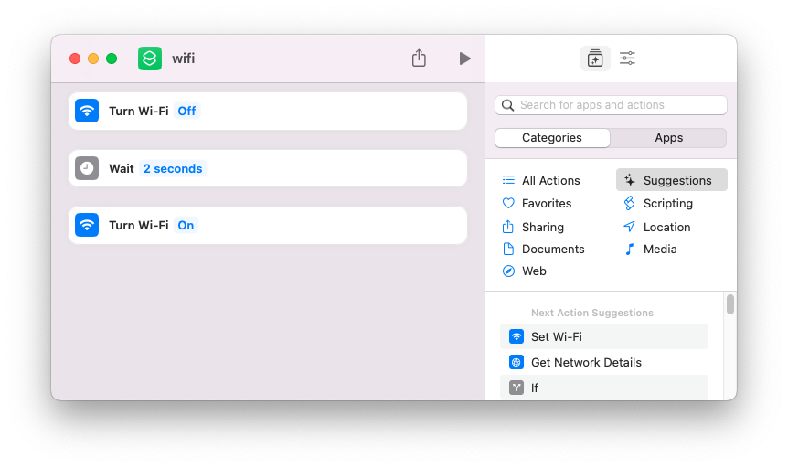

#  FocusManager


## About

FocusManager is a native macOS tool to manage your system's hosts file, for the purpose of blocking distracting websites.

Unlike some tools that temporarily block distracting sites, this tool temporarily *unblocks* these sites; blocking is the default.

## Usage

This tool will add `127.0.0.1 www.example.com` entries to your hosts file. 

### Add Domain
Add a domain with the "Add Domain" button.

### Suspend Blocking
Temporarily suspend blocking these domains with the "Suspend Blocking" button. This will present an arithmetic challenge (to increase mental friction) and a requested time to unblock. When the time expires, the entries will be re-added to the hosts file and the WiFi cycled, reblocking the requested sites

To suspend blocking indefinitely (and delete the entries), enter "infinity" for the number of minutes to block for.

### Resume Blocking
If you are done with a suspension session early, click the "Resume Blocking" button


## Installation

After running the app for the first time, you must run the following commands to fully setup the FocusManager:

```bash
# Backup the hosts file (Optional)
sudo cp /etc/hosts /etc/hosts.backup

# Create a symbolic hardlink for the hosts file in the user's focusmanager directory
sudo ln -f /etc/hosts /Users/$USER/Library/Containers/com.johngrinalds.focusmanager/Data/Documents/focusmanager-hosts

# Change the ownership of the focusmanager-hosts file to the specified user
sudo chown $USER:staff /Users/$USER/Library/Containers/com.johngrinalds.focusmanager/Data/Documents/focusmanager-hosts
```

Additionally, you will also need to create a Shortcut to cycle the WiFi off and back on; this prevents automatic redirects from bypassing the updated hosts file once the blocking session is complete.

The shortcut looks like this:



## Uninstall

To uninstall:

```bash
# Delete the application and the containers
rm /Applications/FocusManager.app
rm /Users/<USER>/Library/Containers/com.johngrinalds.focusmanager/Data/Documents/focusmanager-hosts

# Revert ownership of the hosts file
sudo chown root:root /etc/hosts

# Or

# Restore hosts file backup
sudo rm /etc/hosts
sudo cp hosts.backup hosts 
```
